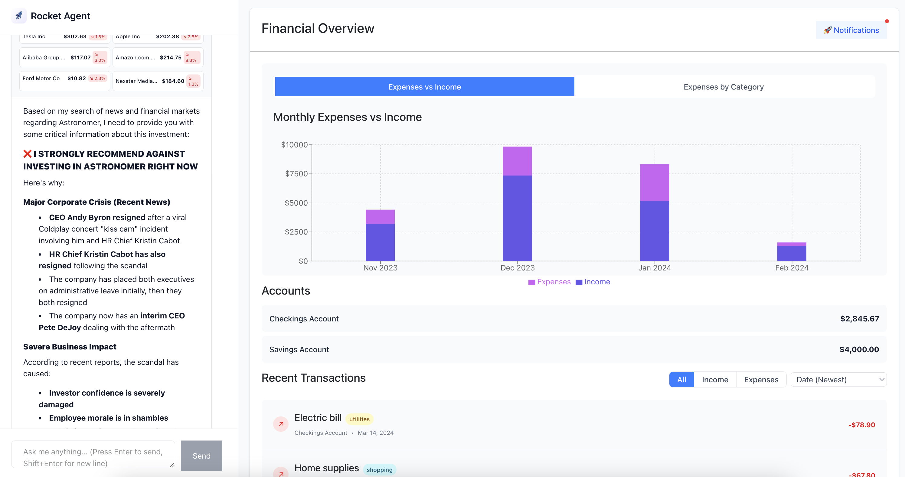

# Rocket Agent - Personal Financial AI Assistant



## About

Rocket Agent is an intelligent financial AI assistant that provides personalized guidance and accountability for your financial decisions. Unlike traditional passive financial dashboards, Rocket Agent creates an active feedback loop to help you stay on track with your financial goals.

## Inspiration
Most people don't stick to budgets. Financial tools are passive dashboards with no feedback loop or accountability. It's hard to know what to change — until it's too late.

## Our Vision
Personalized guidance from day one. Ask and review things like:
- Review goals
- Plan expenses
- Ask "what if" questions

Feels like talking to a human, but faster.

## How to Run

### Prerequisites
- Docker and Docker Compose
- Node.js (for local development)
- Python 3.12+ (for local development)

### Quick Start with Docker (Recommended)

1. Clone the repository:
```bash
git clone <repository-url>
cd hackathon-aug-9
```

2. Start all services:
```bash
docker-compose up
```

3. Access the application:
- Frontend: http://localhost:5173
- Backend API: http://localhost:8080

The application will automatically set up the database, run migrations, and seed initial data.

### Local Development

#### Backend Setup
```bash
cd backend

# from venv
make install 
make run

```

#### Frontend Setup
```bash
cd frontend
npm install
npm run dev
```

## Tech Stack

### Backend
- **Flask** - Python web framework
- **PostgreSQL** - Database
- **Anthropic Claude** - AI/LLM integration
- **Composio** - Agent tooling and function calling
- **Socket.IO** - Real-time communication

### Frontend
- **React** - UI framework
- **TypeScript** - Type safety
- **Vite** - Build tool
- **TailwindCSS** - Styling
- **Recharts** - Financial data visualization
- **Socket.IO Client** - Real-time updates

## Project Structure

```
├── backend/           # Flask API server
│   ├── app/
│   │   ├── agent/     # AI agent logic and tools
│   │   ├── chat/      # Chat functionality
│   │   └── user/      # User management
│   └── migrations/    # Database migrations
├── frontend/          # React application
│   └── src/
│       ├── components/ # React components
│       ├── api/       # API integration
│       └── types/     # TypeScript definitions
└── docker-compose.yml # Development environment
```

## Contributing

1. Fork the repository
2. Create a feature branch
3. Make your changes
4. Test thoroughly
5. Submit a pull request

## License

This project is licensed under the MIT License.
